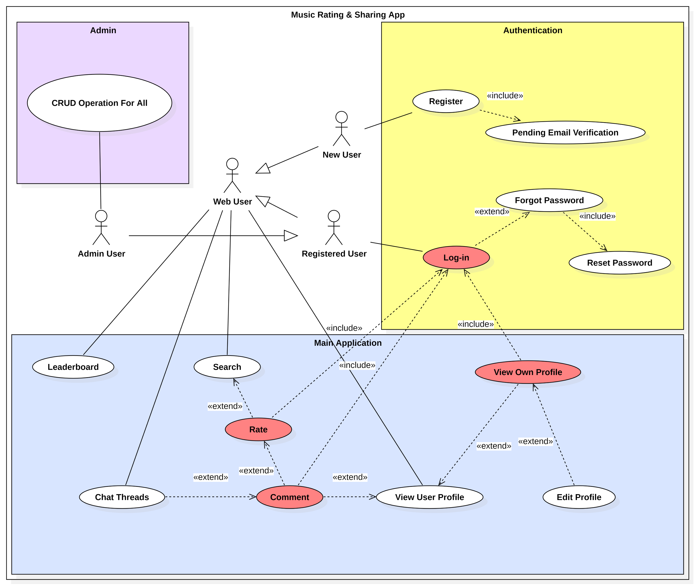

# SYT Feature Flow Diagram
This diagram illustrates the use case in the SYT (Share Your Taste) system.

> View [Use Case Description](.uml/UseCaseDescriptions.docx)

  

# Non-functional requirements

### NFR-1 Scalability
> - The database should handle growth in songs, albums, and user ratings without requiring structural changes.
### NFR-2 Usability
> - The interface must be usable without any prior training
> - Error messages must be clear and guide the user toward a resolution
### NFR-3 Maintainability
> - The codebase must follow a consistent coding standard and be documented
### NFR-4 Arhitecture
> - The app will be built using layerd ahritecture scheme
> - We'll be using an SQL database

# Planification for three iterations

### 1'st Iteration:
- Auth + View + Rate (basic UI + backend)

### 2'nd Iteration:
- Comments + Profiles

### 3'rd Iteration:
- Notifications + Charts + polish
